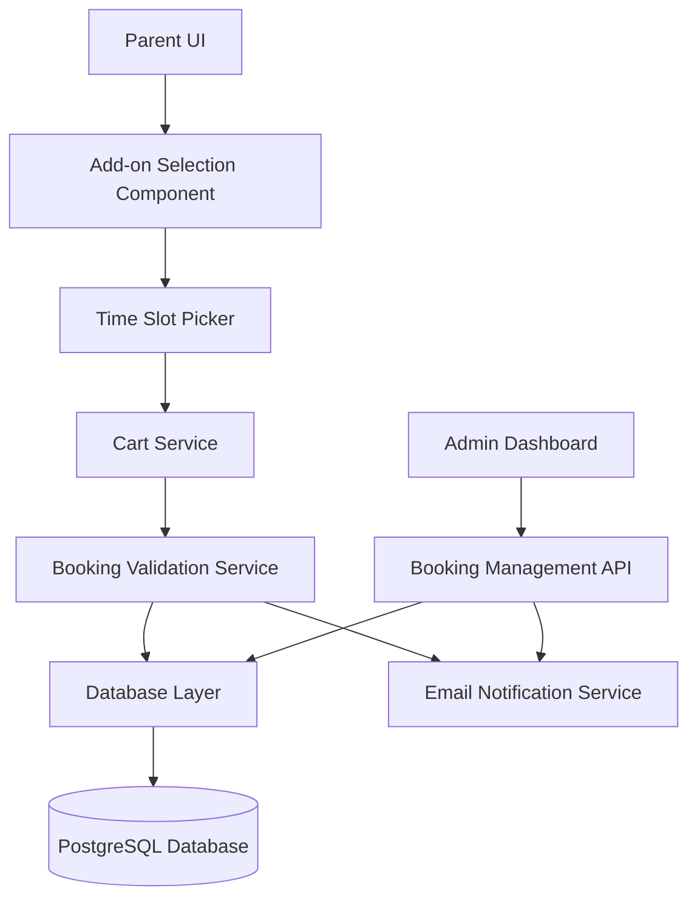

# Design Document: Family Recording Add-on

## Overview

The Family Recording Add-on feature extends the Snow Wolf event registration system to allow parents to purchase exclusive 20-minute voice recording sessions for their families. This add-on is tightly coupled with main course registrations, ensuring that only eligible parents (those who have registered their child for a main course) can book recording sessions.

The design follows a modular approach with clear separation between:
- **Data Layer**: Database schema and models for recording sessions, time slots, and bookings
- **Business Logic Layer**: Validation rules, booking management, and dependency handling
- **API Layer**: RESTful endpoints for CRUD operations
- **UI Layer**: React components for add-on selection, time slot picker, and cart integration
- **Notification Layer**: Email service for confirmations, reminders, and cancellations

## Architecture

### System Components



### Data Flow

1. **Booking Flow**:
   - Parent selects main course → System fetches available time slots
   - Parent selects time slot + family size → Add-on added to cart
   - Parent proceeds to checkout → System validates eligibility and availability
   - Payment confirmed → Booking created, time slot marked unavailable, confirmation email sent

2. **Cancellation Flow**:
   - Parent/Admin cancels main course → System auto-cancels family recording booking
   - System releases time slot → Refund processed based on policy → Cancellation email sent

3. **Modification Flow**:
   - Parent requests modification → System checks new slot availability
   - If available: Release old slot, reserve new slot → Update booking → Send confirmation
   - If unavailable: Maintain original booking → Notify parent

## Components and Interfaces

### Database Schema

#### FamilyRecordingSession Table
```typescript
interface FamilyRecordingSession {
  id: string;                    // UUID primary key
  courseId: string;              // Foreign key to main course
  sessionDate: Date;             // Date of the recording session
  timeSlots: TimeSlot[];         // Array of 4 time slots
  createdAt: Date;
  updatedAt: Date;
}
```

#### TimeSlot Table
```typescript
interface TimeSlot {
  id: string;                    // UUID primary key
  recordingSessionId: string;    // Foreign key to FamilyRecordingSession
  startTime: string;             // Format: "HH:MM" (e.g., "16:00")
  endTime: string;               // Format: "HH:MM" (e.g., "16:20")
  isAvailable: boolean;          // True if slot can be booked
  bookingId: string | null;      // Foreign key to Booking (null if available)
  createdAt: Date;
  updatedAt: Date;
}
```

#### Booking Table
```typescript
interface Booking {
  id: string;                    // UUID primary key
  parentId: string;              // Foreign key to User
  childId: string;               // Foreign key to Child
  mainCourseOrderId: string;     // Foreign key to Order (main course)
  timeSlotId: string;            // Foreign key to TimeSlot
  familySize: number;            // 1-6 people
  price: number;                 // NT$6,500
  status: BookingStatus;         // 'pending' | 'confirmed' | 'cancelled'
  cancellationReason: string | null;
  refundAmount: number | null;
  createdAt: Date;
  updatedAt: Date;
}

type BookingStatus = 'pending' | 'confirmed' | 'cancelled';
```

#### Database Constraints
- `TimeSlot.bookingId` must be unique (one booking per slot)
- `Booking.familySize` must be between 1 and 6
- `Booking.mainCourseOrderId` must reference a valid order
- Cascade delete: When main course order is cancelled, associated booking is cancelled

### API Endpoints

#### GET /api/family-recording/sessions/:courseId
**Purpose**: Fetch available family recording sessions for a specific course

**Request**:
```typescript
// URL parameter
courseId: string
```

**Response**:
```typescript
{
  sessionDate: Date;
  timeSlots: Array<{
    id: string;
    startTime: string;
    endTime: string;
    isAvailable: boolean;
  }>;
}
```

**Validation**:
- Course must exist
- Return 404 if no family recording sessions configured for course

#### POST /api/family-recording/bookings
**Purpose**: Create a new family recording booking

**Request**:
```typescript
{
  parentId: string;
  childId: string;
  mainCourseOrderId: string;
  timeSlotId: string;
  familySize: number;  // 1-6
}
```

**Response**:
```typescript
{
  bookingId: string;
  confirmationNumber: string;
  timeSlot: {
    startTime: string;
    endTime: string;
  };
  familySize: number;
  price: number;
  status: 'confirmed';
}
```

**Validation**:
- Verify main course order exists and belongs to parent
- Verify time slot is available
- Verify family size is 1-6
- Verify session date matches main course date
- Use database transaction to prevent race conditions

#### PATCH /api/family-recording/bookings/:bookingId
**Purpose**: Modify an existing booking (time slot or family size)

**Request**:
```typescript
{
  timeSlotId?: string;      // Optional: new time slot
  familySize?: number;      // Optional: new family size (1-6)
}
```

**Response**:
```typescript
{
  bookingId: string;
  timeSlot: {
    startTime: string;
    endTime: string;
  };
  familySize: number;
  updatedAt: Date;
}
```

**Validation**:
- Verify booking exists and belongs to requesting parent
- If changing time slot: verify new slot is available
- If changing time slot: release old slot atomically
- Verify family size is 1-6

#### DELETE /api/family-recording/bookings/:bookingId
**Purpose**: Cancel a family recording booking

**Request**:
```typescript
// URL parameter
bookingId: string

// Query parameter
reason?: string  // Optional cancellation reason
```

**Response**:
```typescript
{
  bookingId: string;
  status: 'cancelled';
  refundAmount: number;
  refundPolicy: string;
}
```

**Business Logic**:
- Calculate refund based on days until session:
  - >7 days: 100% refund (NT$6,500)
  - 3-7 days: 50% refund (NT$3,250)
  - <3 days: 0% refund
- Release time slot
- Send cancellation email

#### GET /api/admin/family-recording/bookings
**Purpose**: Admin endpoint to view all bookings

**Query Parameters**:
```typescript
{
  sessionDate?: Date;       // Filter by date
  status?: BookingStatus;   // Filter by status
  page?: number;            // Pagination
  limit?: number;           // Items per page
}
```

**Response**:
```typescript
{
  bookings: Array<{
    id: string;
    parentName: string;
    childName: string;
    sessionDate: Date;
    timeSlot: string;
    familySize: number;
    status: BookingStatus;
    createdAt: Date;
  }>;
  pagination: {
    total: number;
    page: number;
    limit: number;
  };
}
```

### UI Components

#### AddOnCard Component
**Purpose**: Display family recording add-on option when main course is selected

**Props**:
```typescript
interface AddOnCardProps {
  courseId: string;
  sessionDate: Date;
  onAddToCart: (timeSlotId: string, familySize: number) => void;
}
```

**Behavior**:
- Fetch available time slots on mount
- Display 4 time slots with availability status
- Show "Fully Booked" if all slots taken
- Disable unavailable slots
- Show price (NT$6,500)
- Include family size selector (1-6)

#### TimeSlotPicker Component
**Purpose**: Interactive time slot selection with real-time availability

**Props**:
```typescript
interface TimeSlotPickerProps {
  timeSlots: TimeSlot[];
  selectedSlotId: string | null;
  onSelect: (slotId: string) => void;
}
```

**Behavior**:
- Display slots in grid layout
- Highlight selected slot
- Show availability status with color coding:
  - Green: Available
  - Yellow: Pending (temporary reservation)
  - Red: Unavailable
- Disable click on unavailable slots

#### FamilySizeSelector Component
**Purpose**: Allow parent to select number of family members

**Props**:
```typescript
interface FamilySizeSelectorProps {
  value: number;
  onChange: (size: number) => void;
  min: number;  // 1
  max: number;  // 6
}
```

**Behavior**:
- Render as dropdown or number input
- Validate range (1-6)
- Show error if out of range

#### CartLineItem Component (Enhanced)
**Purpose**: Display family recording add-on in cart

**Props**:
```typescript
interface CartLineItemProps {
  item: {
    type: 'main-course' | 'family-recording';
    name: string;
    price: number;
    details?: {
      timeSlot?: string;
      familySize?: number;
    };
  };
  onRemove: () => void;
}
```

**Behavior**:
- Show add-on name: "Family Recording Session"
- Display time slot and family size
- Show price: NT$6,500
- Allow removal from cart

## Data Models

### TypeScript Interfaces

```typescript
// Core domain models
interface FamilyRecordingAddOn {
  id: string;
  courseId: string;
  sessionDate: Date;
  price: number;  // Always NT$6,500
  timeSlots: TimeSlot[];
}

interface TimeSlot {
  id: string;
  startTime: string;
  endTime: string;
  isAvailable: boolean;
  bookingId: string | null;
}

interface FamilyRecordingBooking {
  id: string;
  parentId: string;
  childId: string;
  mainCourseOrderId: string;
  timeSlot: TimeSlot;
  familySize: number;
  price: number;
  status: BookingStatus;
  sessionDate: Date;
  createdAt: Date;
  updatedAt: Date;
}

// Cart integration
interface CartItem {
  id: string;
  type: 'main-course' | 'family-recording';
  courseId?: string;
  timeSlotId?: string;
  familySize?: number;
  price: number;
}

// Validation models
interface BookingValidationResult {
  isValid: boolean;
  errors: string[];
}

interface RefundCalculation {
  refundAmount: number;
  refundPercentage: number;
  policy: string;
}
```

### Business Logic Services

#### BookingValidationService
```typescript
class BookingValidationService {
  /**
   * Validates that a parent can book a family recording session
   */
  validateBooking(
    parentId: string,
    mainCourseOrderId: string,
    timeSlotId: string,
    familySize: number
  ): BookingValidationResult {
    // 1. Verify main course order exists
    // 2. Verify main course order belongs to parent
    // 3. Verify time slot exists and is available
    // 4. Verify family size is 1-6
    // 5. Verify session date matches main course date
    // Return validation result
  }

  /**
   * Validates time slot availability (handles race conditions)
   */
  async validateTimeSlotAvailability(
    timeSlotId: string
  ): Promise<boolean> {
    // Use database transaction with row-level locking
    // Check if slot.bookingId is null
    // Return availability status
  }
}
```

#### RefundPolicyService
```typescript
class RefundPolicyService {
  /**
   * Calculates refund amount based on cancellation timing
   */
  calculateRefund(
    sessionDate: Date,
    cancellationDate: Date,
    bookingPrice: number
  ): RefundCalculation {
    const daysUntilSession = this.getDaysDifference(
      cancellationDate,
      sessionDate
    );

    if (daysUntilSession > 7) {
      return {
        refundAmount: bookingPrice,
        refundPercentage: 100,
        policy: 'Full refund (>7 days notice)'
      };
    } else if (daysUntilSession >= 3) {
      return {
        refundAmount: bookingPrice * 0.5,
        refundPercentage: 50,
        policy: '50% refund (3-7 days notice)'
      };
    } else {
      return {
        refundAmount: 0,
        refundPercentage: 0,
        policy: 'No refund (<3 days notice)'
      };
    }
  }

  private getDaysDifference(date1: Date, date2: Date): number {
    const diffTime = Math.abs(date2.getTime() - date1.getTime());
    return Math.ceil(diffTime / (1000 * 60 * 60 * 24));
  }
}
```

#### BookingDependencyService
```typescript
class BookingDependencyService {
  /**
   * Handles cascading cancellation when main course is cancelled
   */
  async handleMainCourseCancellation(
    mainCourseOrderId: string
  ): Promise<void> {
    // 1. Find all family recording bookings for this order
    // 2. For each booking:
    //    - Cancel booking
    //    - Release time slot
    //    - Calculate full refund (100%)
    //    - Send cancellation email
    // 3. Log cancellation events
  }

  /**
   * Handles main course date changes
   */
  async handleMainCourseDateChange(
    mainCourseOrderId: string,
    newDate: Date
  ): Promise<void> {
    // 1. Find family recording bookings for this order
    // 2. Check if family recording sessions exist for new date
    // 3. If yes: Notify parent to select new time slot
    // 4. If no: Auto-cancel booking with full refund
  }
}
```

#### TemporaryReservationService
```typescript
class TemporaryReservationService {
  /**
   * Creates a temporary reservation during checkout
   */
  async createTemporaryReservation(
    timeSlotId: string,
    parentId: string
  ): Promise<{ reservationId: string; expiresAt: Date }> {
    // 1. Mark slot as 'pending'
    // 2. Store reservation with 15-minute expiry
    // 3. Return reservation details
  }

  /**
   * Releases expired temporary reservations
   */
  async releaseExpiredReservations(): Promise<void> {
    // 1. Find all reservations older than 15 minutes
    // 2. Release time slots
    // 3. Delete reservation records
    // Run as scheduled job every 5 minutes
  }

  /**
   * Confirms a temporary reservation
   */
  async confirmReservation(
    reservationId: string,
    bookingId: string
  ): Promise<void> {
    // 1. Update time slot with booking ID
    // 2. Mark slot as unavailable
    // 3. Delete temporary reservation
  }
}
```

## Correctness Properties


*A property is a characteristic or behavior that should hold true across all valid executions of a system—essentially, a formal statement about what the system should do. Properties serve as the bridge between human-readable specifications and machine-verifiable correctness guarantees.*

### Property Reflection

After analyzing all 60 acceptance criteria, I identified several areas of redundancy:

**Redundancy Group 1: Time Slot Availability**
- Criteria 2.3 (mark slot unavailable when booked) and 5.5 (mark slot unavailable after confirmation) are redundant
- Criteria 2.2 (show availability status) and 11.4 (update availability in real-time) overlap significantly
- **Resolution**: Combine into comprehensive properties about slot state transitions and availability display

**Redundancy Group 2: Validation**
- Criteria 3.1 (require family size 1-6) and 3.2 (reject invalid family size) are two sides of the same validation
- Criteria 5.1 (verify main course exists) and 5.2 (prevent checkout without main course) are redundant
- Criteria 5.3 (verify slot not booked) and 5.4 (prevent booking if slot taken) are redundant
- **Resolution**: Combine into single validation properties

**Redundancy Group 3: Notifications**
- Multiple criteria (7.1, 7.4, 8.5, 9.5) all test that emails are sent on various events
- Criteria 7.2 and 7.5 both test email content completeness
- **Resolution**: Create comprehensive notification properties that cover all events

**Redundancy Group 4: Refund Calculation**
- Criteria 10.1, 10.2, 10.3 all test the same refund calculation function with different inputs
- **Resolution**: Single property that tests refund calculation across all time windows

**Redundancy Group 5: Cart Display**
- Criteria 4.3 (show as separate line items) and 4.5 (display time slot and family size) overlap
- **Resolution**: Single property about cart item completeness

After reflection, I've reduced 60 criteria to 25 unique, non-redundant properties.

### Core Properties

**Property 1: Time Slot Structure Invariant**
*For any* family recording session, the system should provide exactly 4 time slots, each with a duration of 20 minutes.
**Validates: Requirements 1.4, 2.1**

**Property 2: Add-on Visibility Dependency**
*For any* UI state, family recording add-on options should be visible if and only if a main course is selected in the cart.
**Validates: Requirements 1.1, 1.2**

**Property 3: Course Indicator Accuracy**
*For any* course, the "Family Recording Available" indicator should be displayed if and only if family recording sessions are configured for that course.
**Validates: Requirements 1.3**

**Property 4: Slot Availability State Transition**
*For any* time slot, when a booking is confirmed for that slot, the slot's availability status should transition from available to unavailable.
**Validates: Requirements 2.3, 5.5**

**Property 5: Availability Display Consistency**
*For any* time slot, the displayed availability status in the UI should match the actual database state at all times.
**Validates: Requirements 2.2, 11.4**

**Property 6: Temporary Reservation Creation**
*For any* time slot selection during checkout, the system should create a temporary reservation that expires after 15 minutes if not confirmed.
**Validates: Requirements 2.4, 2.5**

**Property 7: Family Size Validation**
*For any* family size input, the system should accept values in the range [1, 6] and reject all other values with an error message.
**Validates: Requirements 3.1, 3.2**

**Property 8: Family Size Persistence**
*For any* booking, the family size displayed in the confirmation should equal the family size selected during booking.
**Validates: Requirements 3.4**

**Property 9: Fixed Price Invariant**
*For any* family recording session, the price should always be exactly NT$6,500.
**Validates: Requirements 4.1**

**Property 10: Cart Price Calculation**
*For any* cart containing a main course and family recording add-on, the total price should equal the sum of the main course price and NT$6,500.
**Validates: Requirements 4.2, 4.4**

**Property 11: Cart Item Completeness**
*For any* cart containing a family recording add-on, the cart display should show the add-on as a separate line item with time slot and family size details.
**Validates: Requirements 4.3, 4.5**

**Property 12: Main Course Prerequisite Validation**
*For any* checkout attempt with a family recording add-on, the system should verify that a main course for the same session date exists in the cart, and prevent checkout if not.
**Validates: Requirements 5.1, 5.2**

**Property 13: Double Booking Prevention**
*For any* time slot, the system should prevent multiple bookings by verifying the slot is available before confirming any booking.
**Validates: Requirements 5.3, 5.4, 12.1**

**Property 14: Concurrent Booking Race Condition**
*For any* time slot, when two parents attempt to book simultaneously, exactly one booking should succeed and the other should fail with an error.
**Validates: Requirements 12.2**

**Property 15: Cascading Cancellation**
*For any* main course cancellation, all associated family recording bookings should be automatically cancelled and their time slots released.
**Validates: Requirements 6.1, 6.3**

**Property 16: Notification on State Changes**
*For any* booking state change (creation, modification, cancellation), the system should send an appropriate notification email to the parent.
**Validates: Requirements 6.2, 7.1, 7.4, 8.5, 9.5**

**Property 17: Confirmation Email Completeness**
*For any* booking confirmation email, the content should include session date, time slot, family size, main course details, total price, instructions, and facility location.
**Validates: Requirements 7.2, 7.5**

**Property 18: Scheduled Reminder Emails**
*For any* booking with a session date 3 days away, the system should send a reminder email to the parent.
**Validates: Requirements 7.3**

**Property 19: Time Slot Modification Atomicity**
*For any* booking modification that changes the time slot, the system should atomically release the old slot and reserve the new slot, or maintain the original booking if the new slot is unavailable.
**Validates: Requirements 8.1, 8.3, 8.4**

**Property 20: Family Size Modification**
*For any* booking modification request, the system should allow family size changes within the range [1, 6] and update the booking accordingly.
**Validates: Requirements 8.2**

**Property 21: Admin Dashboard Data Completeness**
*For any* booking displayed in the admin dashboard, the data should include parent name, child name, time slot, family size, booking status, and session date.
**Validates: Requirements 9.2**

**Property 22: CSV Export Completeness**
*For any* booking export request, the generated CSV should contain all booking records with complete data fields.
**Validates: Requirements 9.4**

**Property 23: Refund Calculation Policy**
*For any* booking cancellation, the refund amount should be calculated as: 100% if >7 days before session, 50% if 3-7 days before, 0% if <3 days before, or 100% if cancelled by administrator.
**Validates: Requirements 10.1, 10.2, 10.3, 10.4**

**Property 24: Available Slot Count Accuracy**
*For any* session date, the displayed count of available slots should equal the number of time slots where isAvailable is true.
**Validates: Requirements 11.1**

**Property 25: Date Consistency Validation**
*For any* family recording booking, the session date must match the associated main course session date, enforced through validation.
**Validates: Requirements 12.3, 12.4**

### Edge Case Properties

**Edge Case 1: Empty Response Handling**
*For any* course without family recording sessions configured, the API should return an empty array of time slots without errors.

**Edge Case 2: Fully Booked Display**
*When* all 4 time slots for a session date are unavailable, the UI should display a "Fully Booked" message.
**Validates: Requirements 11.2**

**Edge Case 3: Temporary Reservation Status Display**
*For any* time slot with a temporary reservation, the status should display as "Pending" for users other than the one who created the reservation.
**Validates: Requirements 11.5**

## Error Handling

### Error Categories

**1. Validation Errors**
- Invalid family size (not 1-6)
- Missing main course prerequisite
- Session date mismatch
- Invalid time slot ID

**Response Format**:
```typescript
{
  error: 'VALIDATION_ERROR',
  message: 'Human-readable error message',
  field: 'familySize',  // Optional: which field failed
  code: 'INVALID_FAMILY_SIZE'
}
```

**2. Availability Errors**
- Time slot already booked
- No available slots
- Concurrent booking conflict

**Response Format**:
```typescript
{
  error: 'AVAILABILITY_ERROR',
  message: 'This time slot is no longer available',
  code: 'SLOT_UNAVAILABLE',
  availableSlots: []  // List of alternative slots
}
```

**3. Dependency Errors**
- Main course not found
- Booking not found
- Invalid parent/child relationship

**Response Format**:
```typescript
{
  error: 'DEPENDENCY_ERROR',
  message: 'Main course registration not found',
  code: 'MAIN_COURSE_NOT_FOUND'
}
```

**4. Concurrency Errors**
- Race condition detected
- Stale data
- Lock timeout

**Response Format**:
```typescript
{
  error: 'CONCURRENCY_ERROR',
  message: 'Another booking was made simultaneously. Please try again.',
  code: 'RACE_CONDITION'
}
```

### Error Handling Strategies

**Database Transaction Failures**:
- Use optimistic locking with version numbers
- Retry up to 3 times with exponential backoff
- If all retries fail, return concurrency error to user

**Email Service Failures**:
- Queue email for retry (up to 5 attempts)
- Log failure but don't block booking confirmation
- Admin notification if email fails after all retries

**Temporary Reservation Cleanup**:
- Run scheduled job every 5 minutes
- Use database query to find expired reservations
- Release slots in batch transaction
- Log cleanup statistics

**Data Inconsistency Detection**:
- Validate referential integrity on read operations
- Log inconsistencies with full context
- Send admin notification for manual review
- Attempt automatic repair where safe

## Testing Strategy

### Dual Testing Approach

This feature requires both unit tests and property-based tests for comprehensive coverage:

**Unit Tests**: Focus on specific examples, edge cases, and integration points
- Specific booking scenarios (e.g., booking the first slot, last slot)
- Edge cases (e.g., fully booked sessions, expired reservations)
- Error conditions (e.g., invalid family size, missing main course)
- Integration between components (e.g., cart service + booking validation)

**Property-Based Tests**: Verify universal properties across all inputs
- Run minimum 100 iterations per property test
- Generate random bookings, time slots, family sizes, dates
- Test properties hold for all valid input combinations
- Catch edge cases that manual testing might miss

### Property-Based Testing Configuration

**Library Selection**: Use `fast-check` for TypeScript/JavaScript property-based testing

**Test Configuration**:
```typescript
import fc from 'fast-check';

// Configure all property tests to run 100+ iterations
fc.assert(
  fc.property(/* generators */, (/* inputs */) => {
    // Property assertion
  }),
  { numRuns: 100 }
);
```

**Test Tagging**: Each property test must reference its design document property
```typescript
describe('Family Recording Add-on', () => {
  it('Property 1: Time Slot Structure Invariant - Feature: family-recording-addon', () => {
    // Test implementation
  });
});
```

### Test Coverage Requirements

**Core Functionality**:
- ✅ Time slot creation and structure (Property 1)
- ✅ Booking creation and validation (Properties 7, 12, 13)
- ✅ Price calculation (Properties 9, 10)
- ✅ State transitions (Properties 4, 15)
- ✅ Concurrency control (Property 14)

**Business Logic**:
- ✅ Refund calculation (Property 23)
- ✅ Cascading cancellation (Property 15)
- ✅ Temporary reservations (Property 6)
- ✅ Modification atomicity (Property 19)

**Integration Points**:
- ✅ Cart integration (Properties 2, 11)
- ✅ Email notifications (Properties 16, 17, 18)
- ✅ Admin dashboard (Properties 21, 22)

**Edge Cases**:
- ✅ Fully booked sessions (Edge Case 2)
- ✅ Empty responses (Edge Case 1)
- ✅ Temporary reservation display (Edge Case 3)

### Example Property Test

```typescript
import fc from 'fast-check';
import { BookingService } from './booking-service';
import { TimeSlot } from './models';

describe('Property 13: Double Booking Prevention', () => {
  it('Feature: family-recording-addon, Property 13: For any time slot, the system should prevent multiple bookings', () => {
    fc.assert(
      fc.property(
        fc.record({
          timeSlotId: fc.uuid(),
          parentId1: fc.uuid(),
          parentId2: fc.uuid(),
          familySize: fc.integer({ min: 1, max: 6 })
        }),
        async ({ timeSlotId, parentId1, parentId2, familySize }) => {
          // Setup: Create available time slot
          const slot = await createTimeSlot(timeSlotId);
          
          // Act: Two parents attempt to book simultaneously
          const [result1, result2] = await Promise.all([
            BookingService.createBooking(parentId1, timeSlotId, familySize),
            BookingService.createBooking(parentId2, timeSlotId, familySize)
          ]);
          
          // Assert: Exactly one should succeed
          const successCount = [result1, result2].filter(r => r.success).length;
          expect(successCount).toBe(1);
          
          // Assert: Slot should be unavailable after
          const updatedSlot = await getTimeSlot(timeSlotId);
          expect(updatedSlot.isAvailable).toBe(false);
        }
      ),
      { numRuns: 100 }
    );
  });
});
```

### Testing Priorities

**Phase 1: Core Booking Flow** (Highest Priority)
- Property 13: Double booking prevention
- Property 12: Main course prerequisite
- Property 7: Family size validation
- Property 4: Slot availability transitions

**Phase 2: Business Logic**
- Property 23: Refund calculation
- Property 15: Cascading cancellation
- Property 6: Temporary reservations
- Property 19: Modification atomicity

**Phase 3: Integration & UI**
- Property 2: Add-on visibility
- Property 11: Cart item completeness
- Property 16: Notifications
- Property 21: Admin dashboard

**Phase 4: Edge Cases & Polish**
- Edge cases 1-3
- Property 18: Scheduled reminders
- Property 22: CSV export
- Property 25: Date consistency
