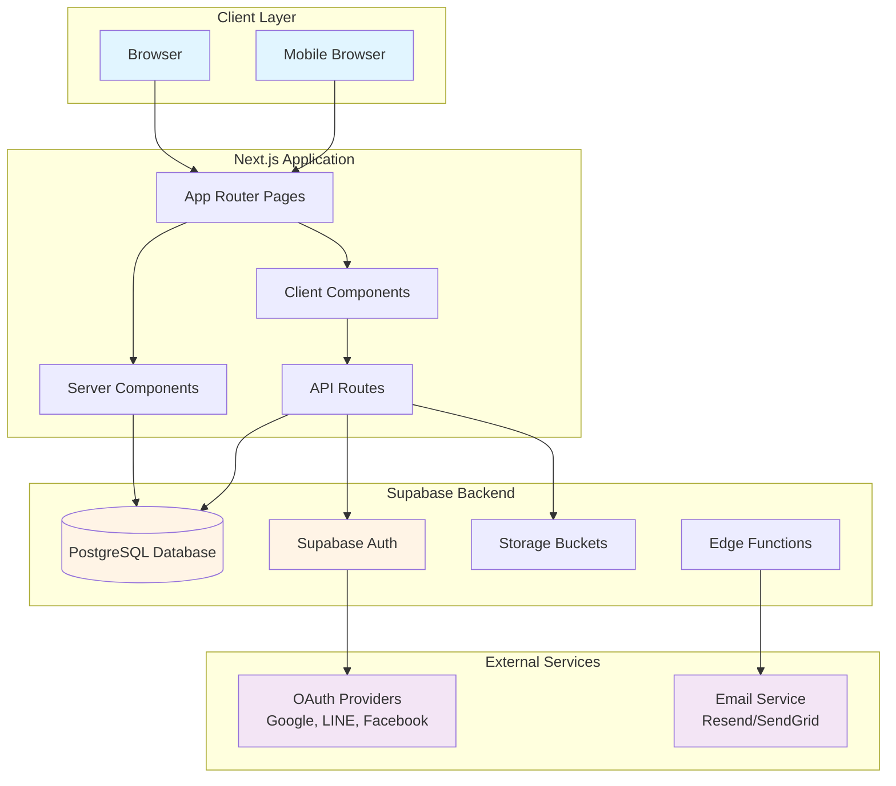
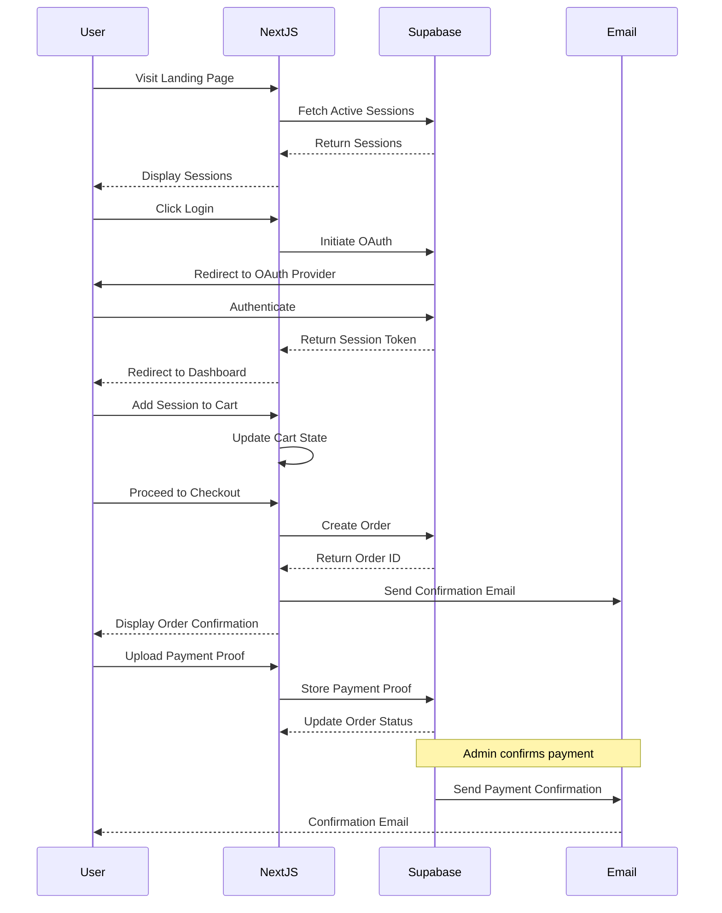

# Design Document: Snow Wolf Boy Event Registration System

## Overview

The Snow Wolf Boy Event Registration System is a premium, mobile-first **one-page web application** built with Next.js 14 (App Router), TypeScript, Tailwind CSS, and Supabase. The system provides a fast, intuitive ordering experience optimized for busy parents, featuring a cinematic brand aesthetic with dark-to-light gradients, moon/snow imagery, and clean typography.

### Design Philosophy

**One-Page Fast Ordering**: The entire user experience happens on a single scrollable page with modals and sidebars for interactions. Parents can browse sessions, add to cart, and checkout without navigating to separate pages. Goal: "3 seconds to understand, 30 seconds to order, 3 minutes to complete payment."

**AAA-Quality UI First**: The initial implementation focuses on delivering a polished, production-ready user interface with mock data. Complex pricing logic and business rules will be implemented in later phases without requiring significant UI restructuring.

**Beautiful Session Cards**: Session cards are the centerpiece of the experience - each card is visually distinct, attractive, and clearly presents all essential information (title, theme, date, time, price, availability) with cinematic Snow Wolf branding.

**Mobile-First Responsive**: All components are designed for mobile devices first, then enhanced for tablet and desktop viewports.

**Cinematic Brand Experience**: The Snow Wolf brand identity is expressed through:

- Dark-to-light gradient backgrounds (deep navy to soft white)
- Moon and snow visual motifs
- Clean, modern typography (Inter for UI, Playfair Display for headings)
- Smooth animations and transitions
- High-quality imagery and iconography
- Premium card-based layouts with proper spacing and hover effects

### Technology Stack

- **Frontend Framework**: Next.js 14 with App Router and Server Components
- **Language**: TypeScript for type safety
- **Styling**: Tailwind CSS with custom design tokens
- **UI Components**: Radix UI primitives + custom components
- **Authentication**: Supabase Auth with OAuth providers (Google, LINE, Facebook)
- **Database**: Supabase PostgreSQL
- **Email**: Supabase Edge Functions + Resend/SendGrid
- **Deployment**: Vercel
- **State Management**: React Server Components + URL state where appropriate

## Architecture

### System Architecture



### Application Flow



### Architectural Principles

1. **Server-First Rendering**: Leverage Next.js Server Components for initial page loads and SEO
2. **Progressive Enhancement**: Core functionality works without JavaScript, enhanced with client-side interactivity
3. **Optimistic UI Updates**: Client components update immediately, sync with server in background
4. **Type Safety**: End-to-end TypeScript from database schema to UI components
5. **Separation of Concerns**: Clear boundaries between presentation, business logic, and data access

## Components and Interfaces

### Component Hierarchy

```
app/
├── page.tsx                        # One-Page Landing (All sections in one page)
├── login/page.tsx                  # Login Page (OAuth)
├── dashboard/page.tsx              # Parent Dashboard (after login)
├── orders/[id]/page.tsx            # Order Detail Page
└── admin/
    ├── dashboard/page.tsx          # Admin Dashboard
    ├── sessions/page.tsx           # Session Management
    ├── orders/page.tsx             # Order Management
    └── waitlist/page.tsx           # Waitlist Management

components/
├── ui/                             # Base UI components (Radix + custom)
│   ├── Button.tsx
│   ├── Card.tsx
│   ├── Input.tsx
│   ├── Modal.tsx
│   ├── Sidebar.tsx                 # NEW: Sliding sidebar component
│   └── ...
├── layout/
│   ├── Header.tsx                  # Simplified: Logo, Language, Login, Cart only
│   ├── Footer.tsx                  # Minimal footer with contact info
│   └── AdminLayout.tsx             # Admin-only layout
├── landing/                        # NEW: One-page landing sections
│   ├── HeroSection.tsx
│   ├── HowItWorksSection.tsx
│   ├── SessionsGridSection.tsx     # Main section with session cards
│   └── FAQSection.tsx
├── sessions/
│   ├── SessionCard.tsx             # CRITICAL: Beautiful, clear card design
│   ├── SessionDetailModal.tsx      # NEW: Modal instead of separate page
│   └── SessionFilters.tsx
├── cart/
│   ├── CartSidebar.tsx             # NEW: Slides from right
│   ├── CartItem.tsx
│   ├── CartSummary.tsx
│   └── CheckoutFlow.tsx            # NEW: Checkout within sidebar
└── admin/
    ├── SessionForm.tsx
    ├── OrderTable.tsx
    └── WaitlistQueue.tsx
```

### Key Component Interfaces

#### SessionCard Component

```typescript
interface SessionCardProps {
  session: {
    id: string;
    title: string;
    theme: string;
    date: Date;
    time: string;
    price: number;
    capacity: number;
    registeredCount: number;
    imageUrl?: string;
  };
  onAddToCart: (sessionId: string) => void;
  onViewDetails: (sessionId: string) => void;
  variant?: "default" | "compact";
}
```

**Responsibilities**:

- Display session information in a beautiful, card-based format with clear visual hierarchy
- Show availability status badge (Available, Limited, Full, Waitlist) with appropriate colors
- Implement smooth hover effects and transitions for premium feel
- Handle "Add to Cart" or "Join Waitlist" button actions
- Handle "View Details" action to open modal (not navigate to new page)
- Ensure AAA-quality visual design with proper spacing, typography, and Snow Wolf branding
- Responsive layout for mobile/desktop with touch-friendly targets (44px minimum)
- Display session image with gradient overlay for text readability

#### CartSidebar Component (NEW)

```typescript
interface CartSidebarProps {
  isOpen: boolean;
  onClose: () => void;
  items: CartItem[];
  children: Child[];
  onUpdateItem: (itemId: string, updates: Partial<CartItem>) => void;
  onRemoveItem: (itemId: string) => void;
  onProceedToCheckout: () => void;
}
```

**Responsibilities**:

- Slide in from right side of screen with smooth animation
- Display cart items grouped by child with clear visual separation
- Show real-time price calculation with bundle discounts
- Allow item removal and child reassignment
- Display "Proceed to Checkout" button prominently
- Transition to checkout mode when user proceeds
- Close/dismiss functionality returning to main page
- Overlay background to focus attention on sidebar

#### SessionDetailModal Component (NEW)

```typescript
interface SessionDetailModalProps {
  session: Session;
  isOpen: boolean;
  onClose: () => void;
  onAddToCart: (sessionId: string) => void;
}
```

**Responsibilities**:

- Display complete session information in modal dialog
- Show session image, full description, duration, age range, capacity status
- Display pricing and bundle discount information
- Provide "Add to Cart" or "Join Waitlist" action
- Close modal returning to main page (no navigation)
- Responsive design for mobile and desktop
- Smooth open/close animations

#### FamilyCart Component

```typescript
interface FamilyCartProps {
  items: CartItem[];
  children: Child[];
  onUpdateItem: (itemId: string, updates: Partial<CartItem>) => void;
  onRemoveItem: (itemId: string) => void;
  onProceedToCheckout: () => void;
}

interface CartItem {
  id: string;
  sessionId: string;
  sessionTitle: string;
  sessionDate: Date;
  sessionPrice: number;
  childId: string;
  childName: string;
}
```

**Responsibilities**:

- Display all cart items grouped by child
- Show price calculation with mock discount logic
- Allow item removal and child reassignment
- Display total price prominently

#### CheckoutFlow Component

```typescript
interface CheckoutFlowProps {
  cartItems: CartItem[];
  children: Child[];
  onSubmitOrder: (orderData: OrderSubmission) => Promise<void>;
}

interface OrderSubmission {
  items: CartItem[];
  groupCode?: string;
  paymentMethod: "bank_transfer" | "line_pay";
  notes?: string;
}
```

**Responsibilities**:

- Multi-step checkout process (Review → Group Code → Payment Method → Confirm)
- Form validation and error handling
- Display final price breakdown
- Submit order and redirect to confirmation

#### AdminSessionForm Component

```typescript
interface AdminSessionFormProps {
  session?: Session;
  onSubmit: (sessionData: SessionFormData) => Promise<void>;
  onCancel: () => void;
}

interface SessionFormData {
  title: { zh: string; en: string };
  theme: { zh: string; en: string };
  description: { zh: string; en: string };
  date: Date;
  time: string;
  duration: number;
  capacity: number;
  price: number;
  ageRange: { min: number; max: number };
  imageUrl?: string;
}
```

**Responsibilities**:

- Create/edit session with bilingual content
- Date/time picker with validation
- Image upload for session thumbnail
- Form validation and error display

### Design System Components

#### Color Palette

```typescript
// tailwind.config.ts
const colors = {
  brand: {
    navy: "#0A1628", // Deep night sky
    midnight: "#1A2B47", // Midnight blue
    slate: "#2D3E5F", // Slate blue
    frost: "#E8F1F8", // Frost white
    snow: "#F8FBFF", // Pure snow
  },
  accent: {
    moon: "#FFE5B4", // Moonlight gold
    ice: "#B8E6F5", // Ice blue
    aurora: "#C8B6FF", // Aurora purple
  },
  semantic: {
    success: "#10B981", // Green
    warning: "#F59E0B", // Amber
    error: "#EF4444", // Red
    info: "#3B82F6", // Blue
  },
};
```

#### Typography

```typescript
// Font configuration
const fonts = {
  heading: "Playfair Display, serif", // Elegant headings
  body: "Inter, sans-serif", // Clean body text
  mono: "JetBrains Mono, monospace", // Code/numbers
};

// Type scale
const fontSize = {
  display: ["4rem", { lineHeight: "1.1", letterSpacing: "-0.02em" }],
  h1: ["3rem", { lineHeight: "1.2", letterSpacing: "-0.01em" }],
  h2: ["2.25rem", { lineHeight: "1.3" }],
  h3: ["1.875rem", { lineHeight: "1.4" }],
  h4: ["1.5rem", { lineHeight: "1.5" }],
  "body-lg": ["1.125rem", { lineHeight: "1.6" }],
  body: ["1rem", { lineHeight: "1.6" }],
  "body-sm": ["0.875rem", { lineHeight: "1.5" }],
  caption: ["0.75rem", { lineHeight: "1.4" }],
};
```

#### Spacing and Layout

```typescript
// Spacing scale (Tailwind default with custom additions)
const spacing = {
  xs: "0.5rem", // 8px
  sm: "0.75rem", // 12px
  md: "1rem", // 16px
  lg: "1.5rem", // 24px
  xl: "2rem", // 32px
  "2xl": "3rem", // 48px
  "3xl": "4rem", // 64px
  "4xl": "6rem", // 96px
};

// Breakpoints
const screens = {
  sm: "640px", // Mobile landscape
  md: "768px", // Tablet
  lg: "1024px", // Desktop
  xl: "1280px", // Large desktop
  "2xl": "1536px", // Extra large
};
```

#### Animation and Transitions

```typescript
// Transition timing
const transitionDuration = {
  fast: "150ms",
  base: "250ms",
  slow: "350ms",
  slower: "500ms",
};

// Easing functions
const transitionTimingFunction = {
  smooth: "cubic-bezier(0.4, 0, 0.2, 1)",
  bounce: "cubic-bezier(0.68, -0.55, 0.265, 1.55)",
  "ease-in-out": "cubic-bezier(0.4, 0, 0.2, 1)",
};
```

## Data Models

### Database Schema

#### Users Table

```sql
CREATE TABLE users (
  id UUID PRIMARY KEY DEFAULT uuid_generate_v4(),
  email TEXT UNIQUE NOT NULL,
  full_name TEXT,
  phone TEXT,
  language_preference TEXT DEFAULT 'zh' CHECK (language_preference IN ('zh', 'en')),
  role TEXT DEFAULT 'parent' CHECK (role IN ('parent', 'owner', 'assistant', 'teacher')),
  created_at TIMESTAMPTZ DEFAULT NOW(),
  updated_at TIMESTAMPTZ DEFAULT NOW()
);

CREATE INDEX idx_users_email ON users(email);
CREATE INDEX idx_users_role ON users(role);
```

#### Children Table

```sql
CREATE TABLE children (
  id UUID PRIMARY KEY DEFAULT uuid_generate_v4(),
  parent_id UUID NOT NULL REFERENCES users(id) ON DELETE CASCADE,
  name TEXT NOT NULL,
  age INTEGER NOT NULL CHECK (age >= 0 AND age <= 18),
  notes TEXT,
  created_at TIMESTAMPTZ DEFAULT NOW(),
  updated_at TIMESTAMPTZ DEFAULT NOW()
);

CREATE INDEX idx_children_parent_id ON children(parent_id);

-- Constraint: Maximum 4 children per parent
CREATE OR REPLACE FUNCTION check_max_children()
RETURNS TRIGGER AS $$
BEGIN
  IF (SELECT COUNT(*) FROM children WHERE parent_id = NEW.parent_id) >= 4 THEN
    RAISE EXCEPTION 'Maximum 4 children per parent';
  END IF;
  RETURN NEW;
END;
$$ LANGUAGE plpgsql;

CREATE TRIGGER enforce_max_children
  BEFORE INSERT ON children
  FOR EACH ROW
  EXECUTE FUNCTION check_max_children();
```

#### Sessions Table

```sql
CREATE TABLE sessions (
  id UUID PRIMARY KEY DEFAULT uuid_generate_v4(),
  title_zh TEXT NOT NULL,
  title_en TEXT NOT NULL,
  theme_zh TEXT NOT NULL,
  theme_en TEXT NOT NULL,
  description_zh TEXT,
  description_en TEXT,
  date DATE NOT NULL,
  time TIME NOT NULL,
  duration_minutes INTEGER NOT NULL,
  capacity INTEGER NOT NULL CHECK (capacity > 0),
  hidden_buffer INTEGER DEFAULT 4 CHECK (hidden_buffer >= 0),
  price DECIMAL(10, 2) NOT NULL CHECK (price >= 0),
  age_min INTEGER CHECK (age_min >= 0),
  age_max INTEGER CHECK (age_max >= age_min),
  image_url TEXT,
  status TEXT DEFAULT 'active' CHECK (status IN ('active', 'cancelled', 'completed')),
  created_at TIMESTAMPTZ DEFAULT NOW(),
  updated_at TIMESTAMPTZ DEFAULT NOW()
);

CREATE INDEX idx_sessions_date ON sessions(date);
CREATE INDEX idx_sessions_status ON sessions(status);
```

#### Orders Table

```sql
CREATE TABLE orders (
  id UUID PRIMARY KEY DEFAULT uuid_generate_v4(),
  order_number TEXT UNIQUE NOT NULL,
  parent_id UUID NOT NULL REFERENCES users(id) ON DELETE CASCADE,
  status TEXT DEFAULT 'pending_payment' CHECK (status IN (
    'pending_payment',
    'payment_submitted',
    'confirmed',
    'cancelled_timeout',
    'cancelled_manual'
  )),
  total_amount DECIMAL(10, 2) NOT NULL CHECK (total_amount >= 0),
  discount_amount DECIMAL(10, 2) DEFAULT 0 CHECK (discount_amount >= 0),
  final_amount DECIMAL(10, 2) NOT NULL CHECK (final_amount >= 0),
  group_code TEXT,
  payment_method TEXT CHECK (payment_method IN ('bank_transfer', 'line_pay')),
  payment_proof_url TEXT,
  payment_deadline TIMESTAMPTZ NOT NULL,
  notes TEXT,
  created_at TIMESTAMPTZ DEFAULT NOW(),
  updated_at TIMESTAMPTZ DEFAULT NOW()
);

CREATE INDEX idx_orders_parent_id ON orders(parent_id);
CREATE INDEX idx_orders_status ON orders(status);
CREATE INDEX idx_orders_payment_deadline ON orders(payment_deadline);
CREATE INDEX idx_orders_group_code ON orders(group_code);

-- Auto-generate order number
CREATE OR REPLACE FUNCTION generate_order_number()
RETURNS TRIGGER AS $$
BEGIN
  NEW.order_number := 'SW' || TO_CHAR(NOW(), 'YYYYMMDD') || '-' || LPAD(NEXTVAL('order_number_seq')::TEXT, 4, '0');
  RETURN NEW;
END;
$$ LANGUAGE plpgsql;

CREATE SEQUENCE order_number_seq;

CREATE TRIGGER set_order_number
  BEFORE INSERT ON orders
  FOR EACH ROW
  EXECUTE FUNCTION generate_order_number();
```

#### Order Items Table

```sql
CREATE TABLE order_items (
  id UUID PRIMARY KEY DEFAULT uuid_generate_v4(),
  order_id UUID NOT NULL REFERENCES orders(id) ON DELETE CASCADE,
  session_id UUID NOT NULL REFERENCES sessions(id) ON DELETE RESTRICT,
  child_id UUID NOT NULL REFERENCES children(id) ON DELETE RESTRICT,
  price DECIMAL(10, 2) NOT NULL CHECK (price >= 0),
  created_at TIMESTAMPTZ DEFAULT NOW()
);

CREATE INDEX idx_order_items_order_id ON order_items(order_id);
CREATE INDEX idx_order_items_session_id ON order_items(session_id);
CREATE INDEX idx_order_items_child_id ON order_items(child_id);

-- Prevent duplicate registrations
CREATE UNIQUE INDEX idx_unique_registration ON order_items(session_id, child_id)
  WHERE EXISTS (
    SELECT 1 FROM orders
    WHERE orders.id = order_items.order_id
    AND orders.status IN ('confirmed', 'pending_payment', 'payment_submitted')
  );
```

#### Waitlist Table

```sql
CREATE TABLE waitlist (
  id UUID PRIMARY KEY DEFAULT uuid_generate_v4(),
  session_id UUID NOT NULL REFERENCES sessions(id) ON DELETE CASCADE,
  parent_id UUID NOT NULL REFERENCES users(id) ON DELETE CASCADE,
  child_id UUID NOT NULL REFERENCES children(id) ON DELETE CASCADE,
  status TEXT DEFAULT 'waiting' CHECK (status IN ('waiting', 'offered', 'claimed', 'expired')),
  offered_at TIMESTAMPTZ,
  expires_at TIMESTAMPTZ,
  created_at TIMESTAMPTZ DEFAULT NOW()
);

CREATE INDEX idx_waitlist_session_id ON waitlist(session_id);
CREATE INDEX idx_waitlist_status ON waitlist(status);
CREATE INDEX idx_waitlist_created_at ON waitlist(created_at);

-- Prevent duplicate waitlist entries
CREATE UNIQUE INDEX idx_unique_waitlist ON waitlist(session_id, child_id)
  WHERE status = 'waiting';
```

#### Admin Actions Log Table

```sql
CREATE TABLE admin_actions (
  id UUID PRIMARY KEY DEFAULT uuid_generate_v4(),
  admin_id UUID NOT NULL REFERENCES users(id) ON DELETE CASCADE,
  action_type TEXT NOT NULL,
  target_type TEXT NOT NULL,
  target_id UUID NOT NULL,
  reason TEXT,
  metadata JSONB,
  created_at TIMESTAMPTZ DEFAULT NOW()
);

CREATE INDEX idx_admin_actions_admin_id ON admin_actions(admin_id);
CREATE INDEX idx_admin_actions_created_at ON admin_actions(created_at);
CREATE INDEX idx_admin_actions_target ON admin_actions(target_type, target_id);
```

### TypeScript Type Definitions

```typescript
// types/database.ts
export interface User {
  id: string;
  email: string;
  full_name: string | null;
  phone: string | null;
  language_preference: "zh" | "en";
  role: "parent" | "owner" | "assistant" | "teacher";
  created_at: string;
  updated_at: string;
}

export interface Child {
  id: string;
  parent_id: string;
  name: string;
  age: number;
  notes: string | null;
  created_at: string;
  updated_at: string;
}

export interface Session {
  id: string;
  title_zh: string;
  title_en: string;
  theme_zh: string;
  theme_en: string;
  description_zh: string | null;
  description_en: string | null;
  date: string;
  time: string;
  duration_minutes: number;
  capacity: number;
  hidden_buffer: number;
  price: number;
  age_min: number | null;
  age_max: number | null;
  image_url: string | null;
  status: "active" | "cancelled" | "completed";
  created_at: string;
  updated_at: string;
}

export interface Order {
  id: string;
  order_number: string;
  parent_id: string;
  status:
    | "pending_payment"
    | "payment_submitted"
    | "confirmed"
    | "cancelled_timeout"
    | "cancelled_manual";
  total_amount: number;
  discount_amount: number;
  final_amount: number;
  group_code: string | null;
  payment_method: "bank_transfer" | "line_pay" | null;
  payment_proof_url: string | null;
  payment_deadline: string;
  notes: string | null;
  created_at: string;
  updated_at: string;
}

export interface OrderItem {
  id: string;
  order_id: string;
  session_id: string;
  child_id: string;
  price: number;
  created_at: string;
}

export interface WaitlistEntry {
  id: string;
  session_id: string;
  parent_id: string;
  child_id: string;
  status: "waiting" | "offered" | "claimed" | "expired";
  offered_at: string | null;
  expires_at: string | null;
  created_at: string;
}

export interface AdminAction {
  id: string;
  admin_id: string;
  action_type: string;
  target_type: string;
  target_id: string;
  reason: string | null;
  metadata: Record<string, any> | null;
  created_at: string;
}
```

### Mock Data Strategy

For the initial AAA-quality UI implementation, we will use mock data that simulates realistic scenarios:

```typescript
// lib/mock-data.ts
export const mockSessions: Session[] = [
  {
    id: "1",
    title_zh: "冬日森林探險",
    title_en: "Winter Forest Adventure",
    theme_zh: "自然探索與創意攝影",
    theme_en: "Nature Exploration & Creative Photography",
    description_zh: "在雪白森林中展開奇幻冒險，捕捉最美的童年時光...",
    description_en: "Embark on a magical adventure in the snowy forest...",
    date: "2024-02-15",
    time: "10:00",
    duration_minutes: 120,
    capacity: 12,
    hidden_buffer: 4,
    price: 2800,
    age_min: 5,
    age_max: 12,
    image_url: "/images/sessions/winter-forest.jpg",
    status: "active",
    created_at: new Date().toISOString(),
    updated_at: new Date().toISOString(),
  },
  // ... more mock sessions
];

export const mockPriceCalculation = (items: CartItem[]): PriceBreakdown => {
  const basePrice = items.reduce((sum, item) => sum + item.sessionPrice, 0);
  const itemCount = items.length;

  // Mock bundle discount logic
  let discountRate = 0;
  if (itemCount >= 3)
    discountRate = 0.15; // 15% off for 3+ sessions
  else if (itemCount === 2) discountRate = 0.1; // 10% off for 2 sessions

  const discountAmount = Math.floor(basePrice * discountRate);
  const finalAmount = basePrice - discountAmount;

  return {
    basePrice,
    discountAmount,
    finalAmount,
    discountLabel: itemCount >= 2 ? `${itemCount}堂課程優惠` : null,
  };
};
```

### API Layer Design

```typescript
// lib/api/sessions.ts
export async function getSessions(filters?: {
  status?: Session["status"];
  dateFrom?: string;
  dateTo?: string;
}): Promise<Session[]> {
  // Implementation will query Supabase
  // For now, returns mock data
  return mockSessions;
}

export async function getSessionById(id: string): Promise<Session | null> {
  return mockSessions.find((s) => s.id === id) || null;
}

export async function getSessionAvailability(sessionId: string): Promise<{
  capacity: number;
  registered: number;
  available: number;
  isWaitlistOnly: boolean;
}> {
  // Mock implementation
  return {
    capacity: 12,
    registered: 8,
    available: 4,
    isWaitlistOnly: false,
  };
}

// lib/api/orders.ts
export async function createOrder(data: {
  parentId: string;
  items: Array<{ sessionId: string; childId: string }>;
  groupCode?: string;
  paymentMethod: "bank_transfer" | "line_pay";
}): Promise<Order> {
  // Implementation will:
  // 1. Calculate total price
  // 2. Set payment deadline (now + 120 hours)
  // 3. Create order and order items
  // 4. Trigger confirmation email

  const paymentDeadline = new Date();
  paymentDeadline.setHours(paymentDeadline.getHours() + 120);

  return {
    id: crypto.randomUUID(),
    order_number: `SW${Date.now()}`,
    parent_id: data.parentId,
    status: "pending_payment",
    total_amount: 5600,
    discount_amount: 560,
    final_amount: 5040,
    group_code: data.groupCode || null,
    payment_method: data.paymentMethod,
    payment_proof_url: null,
    payment_deadline: paymentDeadline.toISOString(),
    notes: null,
    created_at: new Date().toISOString(),
    updated_at: new Date().toISOString(),
  };
}

export async function uploadPaymentProof(orderId: string, file: File): Promise<{ url: string }> {
  // Implementation will:
  // 1. Upload to Supabase Storage
  // 2. Update order with payment_proof_url
  // 3. Update status to 'payment_submitted'

  return { url: "/uploads/payment-proof.jpg" };
}

// lib/api/children.ts
export async function getChildren(parentId: string): Promise<Child[]> {
  return [];
}

export async function createChild(data: {
  parentId: string;
  name: string;
  age: number;
  notes?: string;
}): Promise<Child> {
  return {
    id: crypto.randomUUID(),
    parent_id: data.parentId,
    name: data.name,
    age: data.age,
    notes: data.notes || null,
    created_at: new Date().toISOString(),
    updated_at: new Date().toISOString(),
  };
}

export async function updateChild(
  id: string,
  data: Partial<Pick<Child, "name" | "age" | "notes">>
): Promise<Child> {
  // Implementation will update child record
  throw new Error("Not implemented");
}

export async function deleteChild(id: string): Promise<void> {
  // Implementation will delete child record
  // Will fail if child has confirmed registrations
}
```

現在我需要使用 prework 工具來分析驗收標準，然後再撰寫 Correctness Properties 章節：

## Correctness Properties

_A property is a characteristic or behavior that should hold true across all valid executions of a system—essentially, a formal statement about what the system should do. Properties serve as the bridge between human-readable specifications and machine-verifiable correctness guarantees._

### Property Reflection

After analyzing all acceptance criteria, I identified several areas where properties can be consolidated:

**Consolidated Areas**:

1. **Email notifications** (17.1-17.5): Multiple properties about sending emails can be combined into fewer comprehensive properties
2. **Session display** (2.1, 2.2, 15.3): Properties about displaying session information can be unified
3. **Order status transitions** (6.1, 7.1, 7.2, 8.2): Status change properties can be consolidated
4. **Capacity management** (2.3, 7.4, 8.3): Properties about capacity calculations can be unified
5. **Admin permissions** (13.2-13.5): Role-based access can be tested with fewer properties

**Eliminated Redundancies**:

- Property about displaying payment deadline (6.5) is subsumed by order status display (7.3)
- Property about cart price updates (4.4) is covered by price calculation property (4.1)
- Property about mobile navigation consistency (16.4) is covered by responsive design property (16.1)

### Core Properties

**Property 1: OAuth Authentication Creates or Retrieves User**
_For any_ successful OAuth authentication (Google, LINE, or Facebook), the system should either create a new user record or retrieve an existing one based on the email address.
**Validates: Requirements 1.2**

**Property 2: Session Redirects After Login**
_For any_ authenticated user, logging in should redirect them to either the landing page or their originally intended destination.
**Validates: Requirements 1.3**

**Property 3: Session Persistence Across Navigation**
_For any_ authenticated user, navigating between any pages should maintain their session state without requiring re-authentication.
**Validates: Requirements 1.4**

**Property 4: Logout Clears Session**
_For any_ logged-in user, performing logout should clear their session and redirect them to the public landing page.
**Validates: Requirements 1.5**

**Property 5: Session Cards Display Required Information**
_For any_ active session, its card display should include title, theme, date, time, price, and availability status in the user's selected language.
**Validates: Requirements 2.1, 15.3**

**Property 6: Session Detail Contains Complete Information**
_For any_ session, its detail page should display all required fields including duration, age range, capacity status, and full description.
**Validates: Requirements 2.2**

**Property 7: Remaining Capacity Calculation**
_For any_ session, the displayed remaining capacity should equal (total_capacity - confirmed_registrations).
**Validates: Requirements 2.3**

**Property 8: Full Session Shows Waitlist Option**
_For any_ session where confirmed_registrations >= stated_capacity, the system should display "Full - Join Waitlist" instead of "Register".
**Validates: Requirements 2.4, 9.1**

**Property 9: Bilingual Content Availability**
_For any_ session or public-facing content, both Traditional Chinese and English versions should be available and displayed based on user's language preference.
**Validates: Requirements 2.5, 15.5**

**Property 10: Child Selection Prompt on Cart Addition**
_For any_ session added to cart, the system should prompt the user to select which child(ren) to register.
**Validates: Requirements 3.1**

**Property 11: Maximum Four Children Per Parent**
_For any_ parent account, attempting to add a 5th child should be rejected, while adding 1-4 children should succeed.
**Validates: Requirements 3.2**

**Property 12: Child Creation Requires Name and Age**
_For any_ child creation attempt, the system should require name and age fields (notes optional) and reject submissions missing these required fields.
**Validates: Requirements 3.3**

**Property 13: Family Cart Groups by Child**
_For any_ cart with multiple items, the display should group registrations by child and show each child's selected sessions.
**Validates: Requirements 3.4**

**Property 14: Same Child Multiple Sessions Allowed**
_For any_ child, they should be able to be registered for multiple different sessions within the same order or across different orders.
**Validates: Requirements 3.5**

**Property 15: Base Price Calculation**
_For any_ cart, the base price should equal the sum of all session prices for all selected child-session pairs.
**Validates: Requirements 4.1**

**Property 16: Bundle Discount Application**
_For any_ cart with 2 or more session registrations, the system should automatically apply the configured bundle discount rate to the base price.
**Validates: Requirements 4.2**

**Property 17: Price Breakdown Completeness**
_For any_ cart or checkout summary, the price breakdown should display base price, discount amount (if applicable), and final total.
**Validates: Requirements 4.3**

**Property 18: Group Code Uniqueness**
_For any_ newly created group code, it should be unique across all existing group codes and be alphanumeric.
**Validates: Requirements 5.2**

**Property 19: Group Code Association**
_For any_ order submitted with a valid existing group code, the order should be associated with that group.
**Validates: Requirements 5.3**

**Property 20: Group Membership Display**
_For any_ order with a group code, the confirmation page and admin session view should display the group membership information.
**Validates: Requirements 5.4, 5.5**

**Property 21: Order Creation Sets Pending Status**
_For any_ completed checkout, the created order should have status "pending_payment".
**Validates: Requirements 6.1**

**Property 22: Payment Deadline Calculation**
_For any_ created order, the payment_deadline should equal created_at + 120 hours.
**Validates: Requirements 6.2**

**Property 23: Order Confirmation Email Content**
_For any_ created order, the confirmation email should contain order number, total amount, payment instructions, and payment deadline.
**Validates: Requirements 6.3**

**Property 24: Payment Proof Upload Updates Status**
_For any_ order with status "pending_payment", uploading payment proof should update the status to "payment_submitted" and store the proof URL.
**Validates: Requirements 7.1**

**Property 25: Admin Payment Confirmation**
_For any_ order marked as paid by an admin, the status should update to "confirmed" and a confirmation email should be sent to the parent.
**Validates: Requirements 7.2**

**Property 26: Order Confirmation Reserves Capacity**
_For any_ order that transitions to "confirmed" status, the registered seats should be reserved and the session's available capacity should decrease by the number of registrations.
**Validates: Requirements 7.4**

**Property 27: Parent Order Access**
_For any_ authenticated parent, they should be able to view all their orders (past and current) with complete details.
**Validates: Requirements 7.3, 7.5**

**Property 28: Automatic Order Cancellation**
_For any_ order with status "pending_payment" where (current_time - created_at) >= 120 hours, the system should automatically cancel the order and update status to "cancelled_timeout".
**Validates: Requirements 8.1, 8.2**

**Property 29: Cancelled Order Releases Capacity**
_For any_ order that is cancelled (auto or manual), all registered seats should be released back to the session's available capacity.
**Validates: Requirements 8.3**

**Property 30: Cancellation Triggers Notifications**
_For any_ cancelled order, a cancellation notification email should be sent to the parent, and if seats are released, the waitlist promotion process should be triggered.
**Validates: Requirements 8.4, 8.5**

**Property 31: Waitlist Entry Creation**
_For any_ parent joining a waitlist for a full session, a waitlist entry should be created with timestamp, and their queue position should be displayed.
**Validates: Requirements 9.2**

**Property 32: Waitlist Ordering by Timestamp**
_For any_ session with multiple waitlist entries, when a seat becomes available, the entry with the earliest timestamp should be selected for promotion.
**Validates: Requirements 9.3**

**Property 33: Waitlist Promotion Email**
_For any_ waitlist entry being promoted, an email notification should be sent with a 24-hour claim window (expires_at = offered_at + 24 hours).
**Validates: Requirements 9.4**

**Property 34: Expired Offer Moves to Next**
_For any_ waitlist offer where current_time > expires_at and status is still "offered", the system should mark it as "expired" and promote the next person in queue.
**Validates: Requirements 9.5**

**Property 35: Reminder Scheduling on Confirmation**
_For any_ order that transitions to "confirmed" status, the system should schedule three reminder emails (7 days, 2 days, 1 day before) for each session in the order.
**Validates: Requirements 10.1**

**Property 36: Reminder Email Content**
_For any_ scheduled reminder that is due, the email should contain session details, location, time, and what to bring, in the parent's preferred language.
**Validates: Requirements 10.2, 10.5**

**Property 37: Reminders Only for Confirmed Orders**
_For any_ reminder job execution, it should only send emails for orders with status "confirmed".
**Validates: Requirements 10.3**

**Property 38: Session Cancellation Cancels Reminders**
_For any_ session that is cancelled by an admin, all scheduled reminders for that session should be cancelled.
**Validates: Requirements 10.4**

**Property 39: Admin Session Management**
_For any_ admin user, they should be able to create new sessions with all required fields, edit existing sessions, and cancel sessions with automatic parent notification.
**Validates: Requirements 11.3, 11.4, 11.5**

**Property 40: Admin Manual Order Confirmation**
_For any_ order, an admin should be able to manually mark it as "confirmed" regardless of current payment status.
**Validates: Requirements 12.1**

**Property 41: Admin Manual Cancellation with Reason**
_For any_ order, an admin should be able to manually cancel it and provide a reason, which should be stored.
**Validates: Requirements 12.2**

**Property 42: Admin Manual Waitlist Promotion**
_For any_ waitlist entry, an admin should be able to manually promote it regardless of its position in the queue.
**Validates: Requirements 12.3**

**Property 43: Admin Action Logging**
_For any_ admin override action (manual confirmation, cancellation, waitlist promotion), the system should create a log entry with admin_id, timestamp, action_type, target_id, and reason.
**Validates: Requirements 12.5**

**Property 44: Role-Based Access Control**
_For any_ user, their access to admin functions should be determined by their role: Owner (full access), Assistant (all except role management), Teacher (read-only), Parent (no admin access).
**Validates: Requirements 13.2, 13.3, 13.4, 13.5**

**Property 45: Private Inquiry Submission**
_For any_ submitted private booking inquiry, the system should send the inquiry details to the admin email, display a confirmation message to the parent, and store the inquiry for admin review.
**Validates: Requirements 14.3, 14.4, 14.5**

**Property 46: Mobile-Responsive Layout**
_For any_ page accessed on a mobile viewport, the layout should be optimized for mobile, with touch-friendly elements (minimum 44px), readable text without horizontal scrolling, and optimized assets.
**Validates: Requirements 16.1, 16.2, 16.3, 16.5**

**Property 47: Email Notification Triggers**
_For any_ order lifecycle event (creation, payment confirmation, cancellation, waitlist promotion), the appropriate email notification should be sent to the parent.
**Validates: Requirements 17.1, 17.2, 17.3, 17.4**

**Property 48: Session Data Export Format**
_For any_ session data export, the generated CSV should contain child names, parent contact information, group codes, and payment status with a timestamped filename.
**Validates: Requirements 18.2, 18.5**

**Property 49: Admin Export Capabilities**
_For any_ admin user, they should be able to export session registrations, orders within a date range, and waitlist data in CSV format.
**Validates: Requirements 18.3, 18.4**

## Error Handling

### Error Categories

#### 1. Authentication Errors

```typescript
type AuthError =
  | { type: "oauth_failed"; provider: "google" | "line" | "facebook"; message: string }
  | { type: "session_expired"; message: string }
  | { type: "unauthorized"; requiredRole: string };

// Handling strategy:
// - Display user-friendly error message
// - Redirect to login page for expired sessions
// - Log error details for debugging
```

#### 2. Validation Errors

```typescript
type ValidationError =
  | { type: "missing_required_field"; field: string }
  | { type: "invalid_format"; field: string; expected: string }
  | { type: "constraint_violation"; constraint: string; message: string }
  | { type: "max_children_exceeded"; current: number; max: number };

// Handling strategy:
// - Display inline validation errors on forms
// - Prevent form submission until resolved
// - Provide clear guidance on how to fix
```

#### 3. Business Logic Errors

```typescript
type BusinessError =
  | { type: "session_full"; sessionId: string; waitlistAvailable: boolean }
  | { type: "payment_deadline_passed"; orderId: string; deadline: string }
  | { type: "duplicate_registration"; childId: string; sessionId: string }
  | { type: "insufficient_capacity"; requested: number; available: number };

// Handling strategy:
// - Display contextual error message
// - Offer alternative actions (e.g., join waitlist)
// - Update UI to reflect current state
```

#### 4. System Errors

```typescript
type SystemError =
  | { type: "database_error"; operation: string; message: string }
  | { type: "email_send_failed"; recipient: string; emailType: string }
  | { type: "file_upload_failed"; filename: string; reason: string }
  | { type: "external_service_error"; service: string; message: string };

// Handling strategy:
// - Log error with full context
// - Display generic error message to user
// - Retry transient errors automatically
// - Alert admin for critical failures
```

### Error Handling Patterns

#### Client-Side Error Handling

```typescript
// Form validation with React Hook Form
import { useForm } from "react-hook-form";
import { zodResolver } from "@hookform/resolvers/zod";
import { z } from "zod";

const childSchema = z.object({
  name: z.string().min(1, "請輸入孩子姓名"),
  age: z.number().min(0).max(18, "年齡必須在 0-18 歲之間"),
  notes: z.string().optional(),
});

function ChildForm() {
  const {
    register,
    handleSubmit,
    formState: { errors },
  } = useForm({
    resolver: zodResolver(childSchema),
  });

  const onSubmit = async (data) => {
    try {
      await createChild(data);
      // Success handling
    } catch (error) {
      if (error.type === "max_children_exceeded") {
        // Show specific error message
      }
    }
  };
}
```

#### Server-Side Error Handling

```typescript
// API route error handling
export async function POST(request: Request) {
  try {
    const body = await request.json();

    // Validate input
    const validated = orderSchema.parse(body);

    // Business logic
    const order = await createOrder(validated);

    return Response.json({ success: true, data: order });
  } catch (error) {
    if (error instanceof z.ZodError) {
      return Response.json(
        { success: false, error: { type: "validation_error", details: error.errors } },
        { status: 400 }
      );
    }

    if (error.type === "session_full") {
      return Response.json(
        { success: false, error: { type: "session_full", sessionId: error.sessionId } },
        { status: 409 }
      );
    }

    // Log unexpected errors
    console.error("Unexpected error:", error);

    return Response.json(
      {
        success: false,
        error: { type: "internal_error", message: "An unexpected error occurred" },
      },
      { status: 500 }
    );
  }
}
```

#### Database Error Handling

```typescript
// Supabase error handling
async function createOrderWithRetry(orderData: OrderData, maxRetries = 3): Promise<Order> {
  let lastError: Error;

  for (let attempt = 1; attempt <= maxRetries; attempt++) {
    try {
      const { data, error } = await supabase.from("orders").insert(orderData).select().single();

      if (error) throw error;
      return data;
    } catch (error) {
      lastError = error;

      // Don't retry on constraint violations
      if (error.code === "23505") {
        // Unique violation
        throw new BusinessError("duplicate_registration", error.message);
      }

      // Retry on transient errors
      if (attempt < maxRetries && isTransientError(error)) {
        await sleep(1000 * attempt); // Exponential backoff
        continue;
      }

      break;
    }
  }

  throw new SystemError("database_error", lastError.message);
}
```

### Error Recovery Strategies

1. **Optimistic UI Updates**: Update UI immediately, rollback on error
2. **Automatic Retries**: Retry transient failures with exponential backoff
3. **Graceful Degradation**: Show cached data when real-time data unavailable
4. **User Guidance**: Provide clear next steps when errors occur
5. **Admin Alerts**: Notify admins of critical system errors

## Testing Strategy

### Dual Testing Approach

The system will employ both **unit testing** and **property-based testing** to ensure comprehensive coverage:

- **Unit tests**: Verify specific examples, edge cases, and error conditions
- **Property tests**: Verify universal properties across all inputs
- Both approaches are complementary and necessary for production-ready code

### Unit Testing

**Focus Areas**:

- Specific examples that demonstrate correct behavior
- Integration points between components
- Edge cases and error conditions
- UI component rendering and interactions

**Testing Library**: Vitest + React Testing Library

**Example Unit Tests**:

```typescript
// Example: Session card rendering
describe('SessionCard', () => {
  it('should display session information correctly', () => {
    const session = mockSessions[0]
    render(<SessionCard session={session} />)

    expect(screen.getByText(session.title_zh)).toBeInTheDocument()
    expect(screen.getByText(`NT$ ${session.price}`)).toBeInTheDocument()
  })

  it('should show waitlist button when session is full', () => {
    const fullSession = { ...mockSessions[0], registeredCount: 12, capacity: 12 }
    render(<SessionCard session={fullSession} />)

    expect(screen.getByText('Full - Join Waitlist')).toBeInTheDocument()
  })
})

// Example: Price calculation edge cases
describe('calculatePrice', () => {
  it('should handle empty cart', () => {
    const result = calculatePrice([])
    expect(result.finalAmount).toBe(0)
  })

  it('should apply 10% discount for 2 sessions', () => {
    const items = [
      { sessionPrice: 2800 },
      { sessionPrice: 2800 }
    ]
    const result = calculatePrice(items)
    expect(result.discountAmount).toBe(560)
    expect(result.finalAmount).toBe(5040)
  })
})
```

### Property-Based Testing

**Focus Areas**:

- Universal properties that hold for all inputs
- Comprehensive input coverage through randomization
- Invariants and round-trip properties
- Business rule validation across all scenarios

**Testing Library**: fast-check (JavaScript property-based testing library)

**Configuration**:

- Minimum 100 iterations per property test
- Each test tagged with feature name and property number
- Tag format: `Feature: snow-wolf-event-registration, Property {N}: {property_text}`

**Example Property Tests**:

```typescript
import fc from "fast-check";

// Feature: snow-wolf-event-registration, Property 7: Remaining Capacity Calculation
describe("Property 7: Remaining Capacity Calculation", () => {
  it("should always equal total capacity minus confirmed registrations", () => {
    fc.assert(
      fc.property(
        fc.integer({ min: 1, max: 50 }), // total capacity
        fc.integer({ min: 0, max: 50 }), // confirmed registrations
        (totalCapacity, confirmedRegistrations) => {
          // Ensure confirmed <= total
          const confirmed = Math.min(confirmedRegistrations, totalCapacity);

          const session = createMockSession({ capacity: totalCapacity });
          const remaining = calculateRemainingCapacity(session, confirmed);

          expect(remaining).toBe(totalCapacity - confirmed);
        }
      ),
      { numRuns: 100 }
    );
  });
});

// Feature: snow-wolf-event-registration, Property 22: Payment Deadline Calculation
describe("Property 22: Payment Deadline Calculation", () => {
  it("should always be created_at + 120 hours", () => {
    fc.assert(
      fc.property(
        fc.date(), // random creation date
        (createdAt) => {
          const order = createOrder({ created_at: createdAt });
          const expectedDeadline = new Date(createdAt.getTime() + 120 * 60 * 60 * 1000);

          expect(new Date(order.payment_deadline)).toEqual(expectedDeadline);
        }
      ),
      { numRuns: 100 }
    );
  });
});

// Feature: snow-wolf-event-registration, Property 11: Maximum Four Children Per Parent
describe("Property 11: Maximum Four Children Per Parent", () => {
  it("should reject 5th child and accept 1-4 children", () => {
    fc.assert(
      fc.property(
        fc.array(
          fc.record({
            name: fc.string({ minLength: 1 }),
            age: fc.integer({ min: 0, max: 18 }),
          }),
          { minLength: 1, maxLength: 6 }
        ), // Generate 1-6 children
        async (children) => {
          const parentId = crypto.randomUUID();

          for (let i = 0; i < children.length; i++) {
            if (i < 4) {
              // First 4 should succeed
              await expect(createChild({ parentId, ...children[i] })).resolves.toBeDefined();
            } else {
              // 5th and beyond should fail
              await expect(createChild({ parentId, ...children[i] })).rejects.toThrow(
                "Maximum 4 children"
              );
            }
          }
        }
      ),
      { numRuns: 100 }
    );
  });
});
```

### Integration Testing

**Focus Areas**:

- End-to-end user flows
- Database transactions and rollbacks
- Email sending and scheduling
- OAuth authentication flows

**Testing Strategy**:

- Use Supabase local development environment
- Mock external services (OAuth providers, email service)
- Test critical paths: registration flow, payment flow, admin actions

### Test Coverage Goals

- **Unit Test Coverage**: 80%+ for business logic and utilities
- **Property Test Coverage**: All 49 correctness properties implemented
- **Integration Test Coverage**: All critical user flows
- **E2E Test Coverage**: Happy path for parent and admin flows

### Continuous Integration

- Run all tests on every pull request
- Block merges if tests fail
- Generate coverage reports
- Run property tests with increased iterations (500+) in CI
